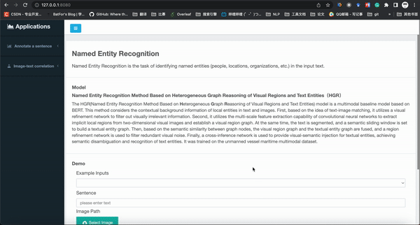

此项目在5楼3090机器上的位置为:/home/mayi/data/ljh/AI_Web
# AI_WEB_PAGE
该系统应用用于可视化展示AI demo，直接运行app.py文件即可,如:
```bash
source activate ljh_trip
python app.py
```

运行成功后，浏览器输入 http://ip:5000 即可访问该系统。 (ip查询指令: ifocnfig) 



## 主要文件说明
目前包括的AI Demo及其对应网页如下:  
1. templates/ner_model_detail.html 对应命名实体识别任务
2. templates/re_model_detail.html 对应实体间关系识别任务
3. templates/trip_extrac_model_detail.html 对应实体关系三元组识别任务
4. templates/text-img_model_detail.html 对应图文相关性度量任务
